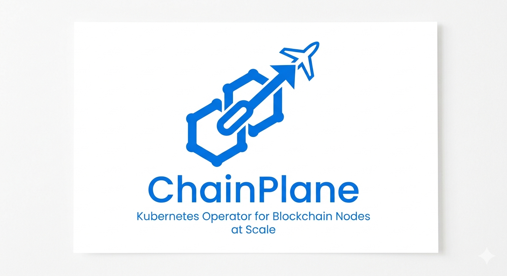

<p align="center">
  
</p>

# ChainPlane

A Kubernetes operator for deploying and managing blockchain full nodes.
Supports **102 chains** with built-in health monitoring, snapshot bootstrapping, and automatic recovery.

[](https://www.apache.org/licenses/LICENSE-2.0)
[](https://golang.org/)
[](https://kubernetes.io/)
[](https://github.com/tazhate/chainplane/releases)

> **⚠ Alpha software.** The CRD API is `v1alpha2` — breaking changes may occur in minor releases until promoted to `v1beta1`. Not recommended for production without thorough testing in your environment. Bug reports and feedback are very welcome.

## Overview

`chainplane` manages the full lifecycle of blockchain nodes on Kubernetes.
Define a `ChainInstance` custom resource and the operator handles everything:
StatefulSet creation, persistent storage, configuration, health monitoring, and automatic recovery.

```yaml
apiVersion: chains.chainplane.io/v1alpha2
kind: ChainInstance
metadata:
  name: bitcoin-mainnet
  namespace: blockchain-nodes
spec:
  chain: bitcoin
  network: mainnet
  nodeGroup: heavy
  storage:
    size: 600Gi
    storageClass: fast-nvme
  resources:
    requests:
      cpu: "2"
      memory: 8Gi
```

## Key Features

- **102 supported chains** — Bitcoin family, Ethereum (4 clients), all major EVM L2s (OP Stack, ZK Stack, Arbitrum Orbit/Nitro), Cosmos SDK ecosystem, Solana, TON, TRON, NEAR, XRP, Stellar, Cardano, Polkadot, Sui, Aptos, and more
- **Chain-specific health checks** — per-chain RPC polling with sync progress, ETA calculation, and peer count tracking
- **Auto-recovery** — nodes stuck in Degraded phase restart automatically after a configurable timeout (default 15 min)
- **Snapshot bootstrap** — MinIO-based snapshot restore to skip days of initial sync
- **Multi-client Ethereum** — Nethermind, Geth, Reth, and Erigon selectable via a single CRD field
- **Adapter pattern** — each chain is a self-contained Go file providing image, config template, health check, CLI flags, env vars, and probes
- **DefaultResources() on all 102 adapters** — recommended CPU/memory/storage derived from official chain documentation; the validating webhook uses these to warn when resources are below recommended minimums
- **VersionPolicy() on 96/102 adapters** — drives `ChainVersionCatalog` auto-tracking by declaring the registry, repository, and tag pattern for each chain image
- **Multi-registry support** — docker.io, ghcr.io, Google Artifact Registry (`us-docker.pkg.dev`), and Amazon ECR Public (`public.ecr.aws`) via a unified OCI v2 client
- **Webhook validation** — admission webhook enforces minimum storage/memory requirements and immutable chain/network fields
- **Sidecars** — attach consensus-layer clients (e.g. Lighthouse for Ethereum) or any helper process

## Quick Start

### Prerequisites

- Go 1.23+
- kubectl 1.25+
- Access to a Kubernetes cluster

### Install via Helm (OCI)

```sh
helm install chainplane oci://ghcr.io/tazhate/charts/chainplane \
  --version 0.2.1 \
  --namespace chainplane-system \
  --create-namespace
```

Or from a specific tag:

```sh
helm install chainplane oci://ghcr.io/tazhate/charts/chainplane \
  --version 0.2.1 \
  --namespace chainplane-system \
  --create-namespace \
  --set image.tag=v0.2.1
```

### Install from source

```sh
git clone https://github.com/tazhate/chainplane.git
cd chainplane
make install
make deploy IMG=ghcr.io/tazhate/chainplane:latest
```

### Create Your First Node

```yaml
apiVersion: chains.chainplane.io/v1alpha2
kind: ChainInstance
metadata:
  name: bitcoin-mainnet
  namespace: blockchain-nodes
spec:
  chain: bitcoin
  network: mainnet
  nodeType: rpc
  nodeGroup: heavy
  storage:
    size: 600Gi
    storageClass: fast-nvme
  resources:
    requests:
      cpu: "2"
      memory: 8Gi
    limits:
      cpu: "4"
      memory: 16Gi
  rpc:
    enabled: true
    port: 8332
```

```sh
kubectl apply -f bitcoin-node.yaml
kubectl get chaininstances -w
```

```
NAME              CHAIN     NETWORK   TYPE   PHASE     HEIGHT    PEERS   SYNC     ETA
bitcoin-mainnet   bitcoin   mainnet   rpc    Syncing   830241    12      73.2%    14h22m
```

Sample manifests for all 102 chains are in [`config/samples/`](config/samples/).

## Architecture

```
ChainInstance CR
       │
       ▼
  Reconciler (30 s loop)
       │
       ├─── Adapter Registry
       │         Each chain adapter provides:
       │         ├── DefaultImage()       container image per client
       │         ├── ConfigTemplate()     renders config file into ConfigMap
       │         ├── HealthCheck()        calls chain RPC → SyncStatus
       │         ├── ContainerArgs()      CLI flags (optional)
       │         ├── ContainerCommand()   entrypoint override (optional)
       │         ├── ContainerEnv()       env vars (optional)
       │         ├── LivenessProbe()      k8s liveness probe
       │         └── StartupProbe()       for slow-starting chains (optional)
       │
       ├─── Managed Resources
       │         ├── StatefulSet          node pod(s)
       │         ├── PVC                  chain data (persistent)
       │         ├── ConfigMap            rendered chain config file
       │         └── Services             RPC + P2P (ClusterIP or NodePort)
       │
       ├─── Health Trigger System
       │         ├── sync_lag             block lag behind chain tip
       │         ├── error_rate           RPC error ratio over time window
       │         ├── latency              p99 RPC response time
       │         ├── crash_loop           container restart count
       │         └── disk_usage           PVC utilization percentage
       │
       └─── Snapshot Init Container      MinIO download + extract before node start
```

Node lifecycle: `Pending` → `Syncing` → `Healthy` → `Degraded` → (auto-restart)

## Supported Chains

### Bitcoin family (UTXO)

| Chain | Image | RPC Port | Storage |
|-------|-------|----------|---------|
| `bitcoin` | `lncm/bitcoind:v28.0` | 8332 | 600+ GiB |
| `litecoin` | `uphold/litecoin-core:0.21` | 9332 | 150+ GiB |
| `dash` | `dashpay/dashd:23.1.0` | 9998 | 50+ GiB |
| `dogecoin` | `ruimarinho/dogecoin:1-alpine` | 22555 | 100+ GiB |
| `rootstock` | `rsksmart/rskj:ARROWHEAD-6.4.0` | 4444 | 100+ GiB |
| `ethereum-classic` | `hyperledger/besu:24.12.0` | 8545 | 100+ GiB |

### Ethereum

| Chain | Default Client | Image | RPC Port |
|-------|---------------|-------|----------|
| `ethereum` | nethermind | `nethermind/nethermind:1.36.1` | 8545 |
| `ethereum-archive` | nethermind | `nethermind/nethermind:1.36.1` | 8545 |
| `ethereum-beacon` | lighthouse | `sigp/lighthouse:v8.0.0` | 5052 |

Ethereum supports multiple clients via `spec.client`:

| Client | Image |
|--------|-------|
| `nethermind` (default) | `nethermind/nethermind:1.36.1` |
| `geth` | `ethereum/client-go:v1.17.1` |
| `reth` | `ghcr.io/paradigmxyz/reth:v1.3.10` |
| `erigon` | `erigontech/erigon:v3.0.5` |

### EVM — OP Stack L2

All OP Stack chains are configured with `--config /config/config.toml` and a `L1_RPC_URL` env var pointing to Ethereum.

| Chain | Image | RPC Port |
|-------|-------|----------|
| `optimism` | `us-docker.pkg.dev/oplabs-tools-artifacts/images/op-geth:v1.101411.2` | 8545 |
| `base` | `us-docker.pkg.dev/oplabs-tools-artifacts/images/op-geth:v1.101411.2` | 8545 |
| `arbitrum` | `offchainlabs/nitro-node:v3.9.7` | 8547 |
| `blast` | `blastio/blast-geth:mainnet-v1.7.0` | 8545 |
| `mode` | `us-docker.pkg.dev/oplabs-tools-artifacts/images/op-geth:v1.101411.2` | 8545 |
| `zora` | `us-docker.pkg.dev/oplabs-tools-artifacts/images/op-geth:v1.101411.2` | 8545 |
| `taiko` | `taikoxyz/taiko-geth:v1.8.0` | 8545 |
| `worldchain` | `us-docker.pkg.dev/oplabs-tools-artifacts/images/op-geth:v1.101603.5` | 8545 |
| `unichain` | `us-docker.pkg.dev/oplabs-tools-artifacts/images/op-geth:v1.101608.0` | 8545 |
| `soneium` | `us-docker.pkg.dev/oplabs-tools-artifacts/images/op-geth:v1.101408.0` | 8545 |
| `swell` | `us-docker.pkg.dev/oplabs-tools-artifacts/images/op-geth:v1.101408.0` | 8545 |
| `superseed` | `us-docker.pkg.dev/oplabs-tools-artifacts/images/op-geth:v1.101408.0` | 8545 |
| `ink` | `us-docker.pkg.dev/oplabs-tools-artifacts/images/op-geth:v1.101408.0` | 8545 |
| `bob` | `us-docker.pkg.dev/oplabs-tools-artifacts/images/op-geth:v1.101408.0` | 8545 |
| `boba-eth` | `bobanetwork/op-geth:v1.101411.4` | 8545 |
| `kroma` | `kromanetwork/geth:v0.5.0` | 8545 |
| `lisk` | `us-docker.pkg.dev/oplabs-tools-artifacts/images/op-geth:v1.101603.5` | 8545 |
| `fraxtal` | `us-docker.pkg.dev/oplabs-tools-artifacts/images/op-geth:v1.101408.0` | 8545 |
| `celo` | `us-docker.pkg.dev/oplabs-tools-artifacts/images/op-geth:v1.101603.5` | 8545 |
| `manta-pacific` | `mantanetwork/op-geth:v1.101304.3` | 8545 |
| `morph` | `ghcr.io/morphprotocol/node:v0.3.0` | 8545 |
| `metis` | `metisprotocol/l2geth:v1.4.2` | 8545 |
| `opbnb` | `ghcr.io/bnb-chain/op-geth:v0.5.2` | 8545 |
| `hemi` | `hemilabs/op-geth:v1.101408.0` | 8545 |
| `plume` | `public.ecr.aws/i6b2w2n6/nitro-node:plume-v2.3.2` | 8547 |
| `everclear` | `offchainlabs/nitro-node:v3.6.0` | 8547 |
| `playnance` | `offchainlabs/nitro-node:v3.6.0` | 8547 |
| `gravity-alpha` | `ghcr.io/celestiaorg/nitro:v3.6.8` | 8547 |
| `doma` | `us-docker.pkg.dev/oplabs-tools-artifacts/images/op-geth:v1.101408.0` | 8545 |
| `katana` | `us-docker.pkg.dev/oplabs-tools-artifacts/images/op-geth:v1.101408.0` | 8545 |
| `goat` | `ghcr.io/goatnetwork/goat-geth:v0.4.2` | 8545 |
| `zircuit` | `ghcr.io/zircuit-labs/l2-geth-public:v1.0.0` | 8545 |

### EVM — ZK Stack L2

ZK Stack external nodes are configured via environment variables (no config file needed).

| Chain | Image | RPC Port |
|-------|-------|----------|
| `zksync` | `matterlabs/external-node:v2.0.22` | 3060 |
| `lens` | `matterlabs/external-node:v24.5.0` | 3060 |
| `abstract` | `matterlabs/external-node:v24.5.0` | 3060 |
| `zero-network` | `matterlabs/external-node:v24.5.0` | 3060 |
| `cronos-zkevm` | `ghcr.io/cronos-labs/external-node:mainnet-v29.6.0` | 3060 |

### EVM — Other L2 / Sidechain

| Chain | Image | RPC Port |
|-------|-------|----------|
| `polygon` | `0xpolygon/bor:2.6.3` | 8545 |
| `polygon-zkevm` | `0xpolygonhermez/zkevm-node:v0.7.0` | 8545 |
| `gnosis` | `nethermind/nethermind:1.36.1` | 8545 |
| `gnosis-beacon` | `sigp/lighthouse:v6.0.1` | 5052 |
| `mantle` | `mantlenetworkio/op-geth:v1.0.3` | 8545 |
| `linea` | `consensys/linea-besu:24.12.2` | 8545 |
| `scroll` | `scrolltech/l2geth:scroll-v5.9.0` | 8545 |
| `cronos` | `crypto-org-chain/cronos:v1.4.4` | 8545 |
| `ronin` | `ghcr.io/ronin-chain/ronin:v2.8.3` | 8545 |
| `fuse` | `fusenet/node:2.0.2` | 8545 |
| `core` | `coredao/core-chain:v1.0.22` | 8545 |
| `wemix` | `wemixnetwork/wemix:v1.2.0` | 8588 |
| `immutable-zkevm` | `ghcr.io/immutable/immutable-geth/immutable-geth:v1.0.0` | 8545 |
| `aurora` | `nearaurora/srpc2-relayer:latest` | 8545 |
| `telos` | `telosnetwork/telos-evm-rpc:v2.0.0` | 8545 |
| `thundercore` | `thundercore/thunder:r4.1.3` | 8545 |
| `klaytn` | `klaytn/klaytn:v2.2.0` | 8551 |
| `viction` | `buildonviction/node:v2.5.1` | 8545 |
| `haqq` | `alhaqq/haqq:v1.8.1` | 8545 |
| `hashkey` | `hashkeychain/hashkey-geth:v1.0.0` | 8545 |
| `shibarium` | `shibaone/bor:v1.3.7-bone` | 8545 |
| `bittorrent` | `bttcprotocol/bttc:v1.0.3` | 8545 |
| `sonic` | `ghcr.io/0xsoniclabs/sonic:v2.1.6` | 18545 |
| `moonbeam` | `moonbeamfoundation/moonbeam:v0.39.1` | 9933 |
| `moonriver` | `moonbeamfoundation/moonbeam:v0.39.1` | 9933 |
| `berachain` | `ghcr.io/berachain/beacon-kit:v0.2.0` | 26657 |
| `hyperliquid` | `hyperliquid/hl-node:latest` | 3001 |
| `monad` | `monadlabs/monad-node:latest` | 8545 |
| `megaeth` | `megaeth-labs/node:latest` | 8545 |
| `plasma` | `plasma-next/node:v0.1.0` | 8545 |
| `moca` | `moca-network/moca:v0.1.0` | 8545 |

### Cosmos SDK

All Cosmos chains use `--home /data` for snapshot compatibility.

| Chain | Image | RPC Port |
|-------|-------|----------|
| `cosmos` | `ghcr.io/cosmos/gaia:v27.0.0` | 26657 |
| `osmosis` | `osmolabs/osmosis:v31.0.0` | 26657 |
| `sei` | `seiprotocol/seid:v6.2.0` | 26657 |
| `axelar` | `axelarnet/axelar-core:v1.3.4` | 26657 |
| `kava` | `kava-labs/kava:v0.26.2` | 26657 |
| `evmos` | `tharsishq/evmos:v20.0.0` | 26657 |
| `dymension` | `dymensionxyz/dymd:v3.1.0` | 26657 |
| `mezo` | `mezo/mezod:v2.0.1` | 26657 |
| `moca` | `moca-network/moca:v0.1.0` | 26657 |
| `harmony` | `harmonyone/harmony:v8.5.4` | 9500 |

### Other chains

| Chain | Image | RPC Port | Notes |
|-------|-------|----------|-------|
| `solana` | `solanalabs/agave:v2.1.0` | 8899 | |
| `bsc` | `ghcr.io/bnb-chain/bsc:1.6.7` | 8545 | |
| `avalanche` | `avaplatform/avalanchego:v1.14.1` | 9650 | |
| `ton` | `ghcr.io/ton-blockchain/ton:v2026.02-1` | 30003 | custom UDP ADNL NodePort |
| `tron` | `tronprotocol/java-tron:GreatVoyage-v4.8.1` | 8090 | JDK 11 recommended |
| `near` | `nearprotocol/nearcore:2.10.7` | 3030 | state sync via GCS |
| `xrp` | `xrpllabsofficial/xrpld:3.1.2` | 5005 | |
| `stellar` | `stellar/stellar-core:v19.12.0` | 11626 | |
| `cardano` | `ghcr.io/intersectmbo/cardano-node:10.6.2` | 12798 | |
| `sui` | `mysten/sui-node:v1.39.2` | 9000 | |
| `aptos` | `aptoslabs/validator:mainnet` | 8080 | |
| `polkadot` | `parity/polkadot:v1.16.2` | 9944 | |
| `kusama` | `parity/polkadot:v1.15.1` | 9944 | |
| `starknet` | `nethermindeth/juno:v0.12.5` | 6060 | uses Juno client |
| `filecoin` | `filecoin/lotus:v1.35.0` | 1234 | |
| `fantom` | `fantomfoundation/go-opera:v1.1.3-txtracing` | 18545 | |

## CRD Reference

### Spec

| Field | Type | Description | Default |
|-------|------|-------------|---------|
| `chain` | string | Chain identifier (see supported chains) | **required** |
| `network` | string | `mainnet`, `testnet`, or `devnet` | `mainnet` |
| `nodeType` | string | `rpc`, `archive`, `validator`, `light` | `rpc` |
| `client` | string | Client override (e.g. `geth`, `reth`, `erigon`) | adapter default |
| `image` | ImageSpec | Override container image | adapter default |
| `resources` | ResourceRequirements | CPU/memory requests and limits | none |
| `storage.size` | Quantity | PVC size (e.g. `600Gi`, `2Ti`) | **required** |
| `storage.storageClass` | string | Kubernetes StorageClass name | cluster default |
| `nodeGroup` | string | Hardware tier: `light`, `medium`, `heavy`, `archive`, `storage` | `medium` |
| `replicas` | int32 | Pod count (set `0` to pause) | `1` |
| `rpc.enabled` | bool | Expose RPC endpoint | `true` |
| `rpc.port` | int32 | HTTP RPC port | `8545` |
| `rpc.wsPort` | int32 | WebSocket RPC port | none |
| `extraArgs` | []string | Additional CLI arguments appended after adapter args | none |
| `extraEnv` | []EnvVar | Additional environment variables | none |
| `health.blockLagThreshold` | int64 | Max block lag before Degraded | chain default |
| `health.degradedTimeoutMinutes` | int32 | Minutes in Degraded before auto-restart (`0` disables) | `15` |
| `snapshot.disabled` | bool | Skip snapshot, sync from genesis | `false` |
| `snapshot.type` | string | `full` or `lite` (pruned snapshot) | `full` |
| `snapshot.bucket` | string | Override MinIO bucket name | `snapshots-{chain}` |
| `sidecars` | []Container | Additional containers (e.g. consensus client) | none |
| `extraVolumes` | []Volume | Additional pod volumes | none |
| `extraVolumeMounts` | []VolumeMount | Additional volume mounts for main container | none |

### Status

| Field | Description |
|-------|-------------|
| `phase` | `Pending` / `Syncing` / `Healthy` / `Degraded` / `Failed` |
| `blockHeight` | Latest confirmed block / slot / ledger number |
| `syncProgress` | Human-readable percentage, e.g. `98.5%` |
| `syncETA` | Estimated time to full sync, e.g. `2h15m` |
| `peersCount` | Connected peer count |
| `conditions` | Standard k8s conditions (`Ready`, `Syncing`, `Degraded`) |

## Health Monitoring

The controller polls each node every **30 seconds** using chain-specific RPC calls.

### Phase transitions

```
Pending ──► Syncing ──► Healthy
               ▲             │
               │             ▼
               └──────── Degraded ──► (auto-restart after degradedTimeoutMinutes)
```

### Health triggers

Five independent triggers evaluate node health:

| Trigger | What it checks | Default threshold |
|---------|---------------|-------------------|
| `sync_lag` | Block lag behind chain tip | ETH: 30, BTC: 2, TRON: 200, SOL: 150 slots |
| `error_rate` | RPC error ratio | > 5% over 5 min |
| `latency` | p99 RPC response time | ETH: 2.0s, SOL: 0.5s |
| `crash_loop` | Container restart count | 3 restarts in 10 min |
| `disk_usage` | PVC utilization | > 90% |

### Stall detection

Block height changes are tracked via pod annotations. Chain-specific logic marks nodes as
`StallExempt` when a frozen height is expected (e.g. Ethereum pipeline stages, Stellar bucket
apply, TON state download, TRON LiteFullNode cache build) to prevent false restarts.

## Snapshot Bootstrap

The operator supports MinIO-based snapshot bootstrapping to skip initial sync.

**Setup:**

1. Set `MINIO_ENDPOINT` env var on the operator deployment (e.g. `http://minio:9000`)
2. Upload snapshots to MinIO buckets named `snapshots-{chain}` (e.g. `snapshots-bitcoin`)
3. On first start, an init container downloads and extracts the snapshot before the node starts

```yaml
spec:
  snapshot:
    type: lite    # full (default) or lite (pruned, e.g. TRON: ~60 GiB vs ~2.9 TiB)
```

Disable to sync from genesis:

```yaml
spec:
  snapshot:
    disabled: true
```

## Ethereum Multi-Client Support

```yaml
spec:
  chain: ethereum
  client: reth    # nethermind (default) | geth | reth | erigon
```

The adapter automatically selects the correct image, config format (TOML/JSON), and CLI flags for each client.

## Attaching a Consensus Layer

```yaml
spec:
  chain: ethereum
  client: reth
  sidecars:
    - name: lighthouse
      image: sigp/lighthouse:v8.0.0
      args:
        - lighthouse
        - bn
        - --network=mainnet
        - --execution-endpoint=http://localhost:8551
        - --jwt-secrets=/jwt/jwt.hex
        - --checkpoint-sync-url=https://mainnet.checkpoint.sigp.io
```

## Development

```sh
make build          # Build manager binary
make test           # Unit tests with coverage
make test-e2e       # E2E tests (requires Kind cluster)
make lint           # golangci-lint
make manifests      # Regenerate CRDs and RBAC
make docker-build   # Build Docker image
```

See [CONTRIBUTING.md](CONTRIBUTING.md) for how to add support for a new chain adapter.

### Documentation

| Doc | Description |
|-----|-------------|
| [docs/getting-started.md](docs/getting-started.md) | Installation and first steps |
| [docs/architecture.md](docs/architecture.md) | Component overview and reconciliation flow |
| [docs/configuration.md](docs/configuration.md) | CRD spec fields (full configuration reference) |
| [docs/adapters.md](docs/adapters.md) | All supported chains — images, ports, health checks |
| [docs/adding-new-chain.md](docs/adding-new-chain.md) | Adapter development guide |
| [docs/registry-support.md](docs/registry-support.md) | Supported image registries (docker.io, ghcr.io, GAR, ECR Public) |
| [docs/fleet-dashboard.md](docs/fleet-dashboard.md) | Web UI for fleet-wide node status |
| [docs/release-process.md](docs/release-process.md) | Release workflow (for maintainers) |
| [docs/health-monitoring.md](docs/health-monitoring.md) | Health trigger system deep-dive |
| [docs/chain-verification.md](docs/chain-verification.md) | Adapter verification report |

## License

Licensed under the [Apache License, Version 2.0](LICENSE). See [NOTICE](NOTICE) for attribution requirements.

```
Copyright (c) 2026 tazhate <hate@tazhate.ru>
SPDX-License-Identifier: Apache-2.0
```
