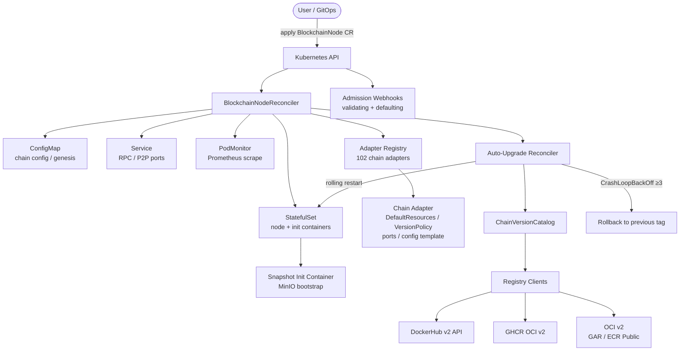

# Architecture

## Overview

The chainplane is a Kubernetes operator that manages blockchain node workloads declaratively. Users declare the desired state via Custom Resources and the operator continuously reconciles the actual cluster state to match — creating and maintaining StatefulSets, ConfigMaps, Services, and PodMonitors for each blockchain node, handling upgrades, rollbacks, and snapshot bootstrapping automatically.

## Custom Resource Definitions

### BlockchainNode

The primary CRD. Each instance describes one blockchain node: the chain type (via `.spec.chain`), the container image or version tracking policy, resource requirements, storage, networking, and health thresholds. The operator owns all child resources created from a BlockchainNode.

### ChainVersionCatalog

A cluster-scoped CRD that holds discovered image tags per chain. The operator polls configured container registries on a schedule and writes the latest resolved tag back into this resource. BlockchainNodeReconciler reads from it when `VersionPolicy` tracking is enabled on a node.

## Component Diagram



## Reconciliation Flow

1. **Fetch CR** — load the `BlockchainNode` object; requeue on not-found after a short delay.
2. **Resolve adapter** — look up the chain adapter in the registry by `spec.chain`; return a permanent error for unknown chains.
3. **Handle deletion / finalizer** — if DeletionTimestamp is set, run cleanup (remove PodMonitor, external resources) and strip the finalizer; otherwise ensure the finalizer is present.
4. **ensureConfigMap** — render the chain-specific config template via the adapter and create-or-update the ConfigMap.
5. **ensureStatefulSet** — merge adapter defaults with user overrides (resources, storage, env, ports); create-or-update the StatefulSet. If a snapshot URL is configured, inject the init container.
6. **ensureService** — reconcile the headless Service and, if enabled, a separate LoadBalancer/NodePort Service for RPC exposure.
7. **ensurePodMonitor** — create or update the Prometheus Operator `PodMonitor` using the metrics port declared by the adapter.
8. **reconcileUpgrade** — if `VersionPolicy` is active, compare the running image tag against the latest tag in `ChainVersionCatalog`; trigger a rolling restart when a newer tag is found.
9. **refreshStatus** — update `.status` fields: current image, sync phase, block height, peer count, health condition, last upgrade time.

## Health Monitoring

The operator watches pod metrics and logs to derive node health:

- **Block-lag threshold** — if the node's block height lags behind peers or a reference RPC endpoint by more than `spec.health.maxBlockLag`, the condition is set to `Degraded`.
- **Sync stall detection** — if the block height does not advance for longer than `spec.health.syncStallTimeout`, the node is considered stalled.
- **Peer count** — if connected peers fall below `spec.health.minPeers`, a warning condition is emitted.
- **Auto-restart on degraded timeout** — if the node remains in `Degraded` for longer than `spec.health.autoRestartTimeout`, the operator deletes the pod to trigger a fresh start. The threshold is configurable per node to avoid restart loops on slow-syncing chains.

Full details: [health-monitoring.md](health-monitoring.md).

## ChainVersionCatalog and Registry Polling

Each chain adapter declares a `VersionPolicy` that specifies:

- `registry` — which registry client to use
- `image` — the repository path
- `tagPattern` — a regex that filters valid release tags (e.g. `^v\d+\.\d+\.\d+$`)

The catalog controller polls each registry on a configurable interval (default 1 h), collects all matching tags, applies semver normalization and sorting, and writes the latest resolved tag into the `ChainVersionCatalog` status. The `BlockchainNodeReconciler` reads this value during `reconcileUpgrade`.

Adapters where only a `:latest` tag is published (Aptos, Aurora, HyperLiquid, MegaETH, Monad) have `VersionPolicy` disabled — auto-tracking is not possible for these chains.

## Auto-Upgrade State Machine

```
Running ──[newer tag available]──> Upgrading
              |
              └──[rollout healthy]──> Running
              |
              └──[CrashLoopBackOff ≥3 restarts]──> Rolling back
                          |
                          └──> Running (previous tag restored)
```

The operator records the previous image tag in an annotation on the StatefulSet before each upgrade. On rollback, that annotation is read and the image is reverted. The upgrade history (timestamp, from-tag, to-tag, outcome) is appended to `.status.upgradeHistory`.
